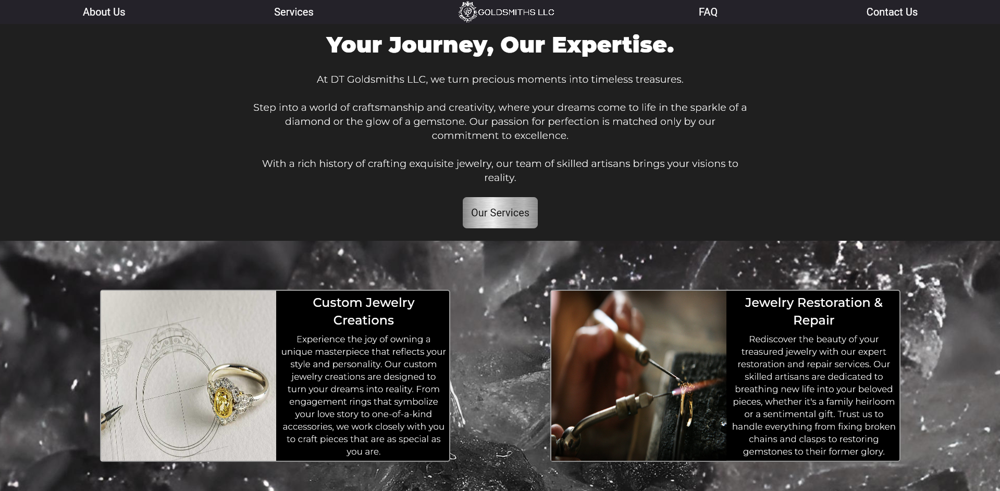

# DT Goldsmiths Website (Flutter Web)

A **static business website** prototype built in **Flutter Web** for DT Goldsmiths.  
The project showcases a clean layout, company information, and a simple contact form to reach out directly.  
Although the project was not completed, it highlights frontend development and Flutter Web design skills.  

---

## Features

- **Landing Page**  
  - Business branding and introductory content  
  - Modern responsive layout  

- **Contact Form**  
  - Input fields for name, email, and message  
  - Sends inquiries directly to the business (planned integration with backend or email service)  

- **Static Pages**  
  - About section  
  - Services/offerings overview  

- **Built with Flutter Web**  
  - Cross-platform, responsive design  
  - Simple to extend or re-theme for other businesses  

---

## Tech Stack

- **Frontend:** Flutter (Dart)  
- **Web Deployment:** Flutter Web build  
- **Planned Integrations:** Email service (SMTP, API-based, or Firebase)  

Project Status

This project was left unfinished when the client decided not to move forward with a website at the time.
The code remains as a reference and portfolio piece for showcasing Flutter Web development.

